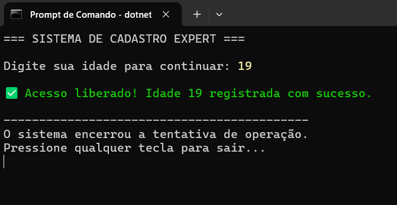
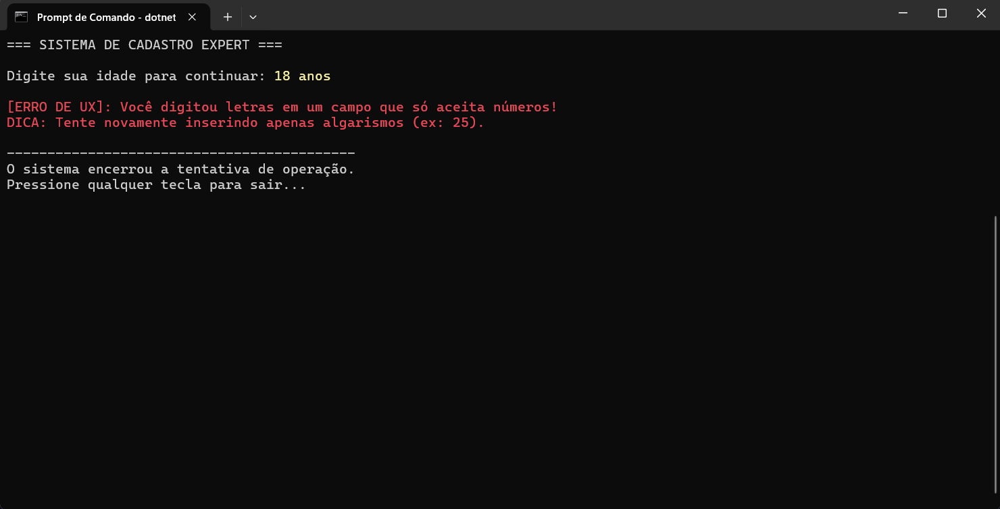
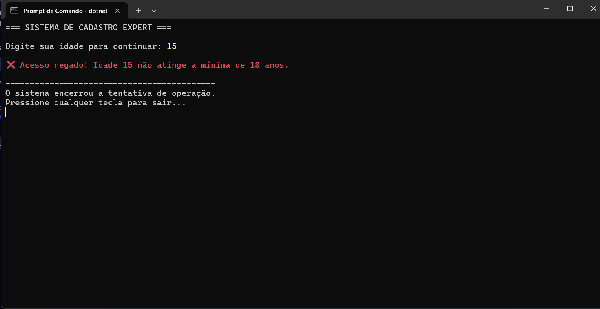

# una-ihcux-lista04
# Operação Escudo Digital

`try-catch` é uma estrutura usada para tratar erros durante a execução do programa. O bloco `try` contém o código que pode falhar, e o `catch` captura o erro caso ele aconteça, evitando que o sistema pare de funcionar de forma inesperada. Isso se conecta com a prevenção de erros porque permite lidar com falhas de maneira controlada, aumentando a segurança e a estabilidade da aplicação.

## Funcionalidades desse codigo em C#

Esse código limpa a tela, exibe o nome do sistema e pede a idade do usuário. Em seguida, verifica se a idade é suficiente para liberar ou negar o acesso. Ele também usa try-catch para tratar erros de digitação, como quando o usuário insere letras em vez de números, mostrando uma mensagem mais amigável. No final, o programa encerra de forma organizada, restaurando as cores do console e aguardando uma tecla para fechar.

## Evidencias
# Sucesso

# Erro

# Extra

